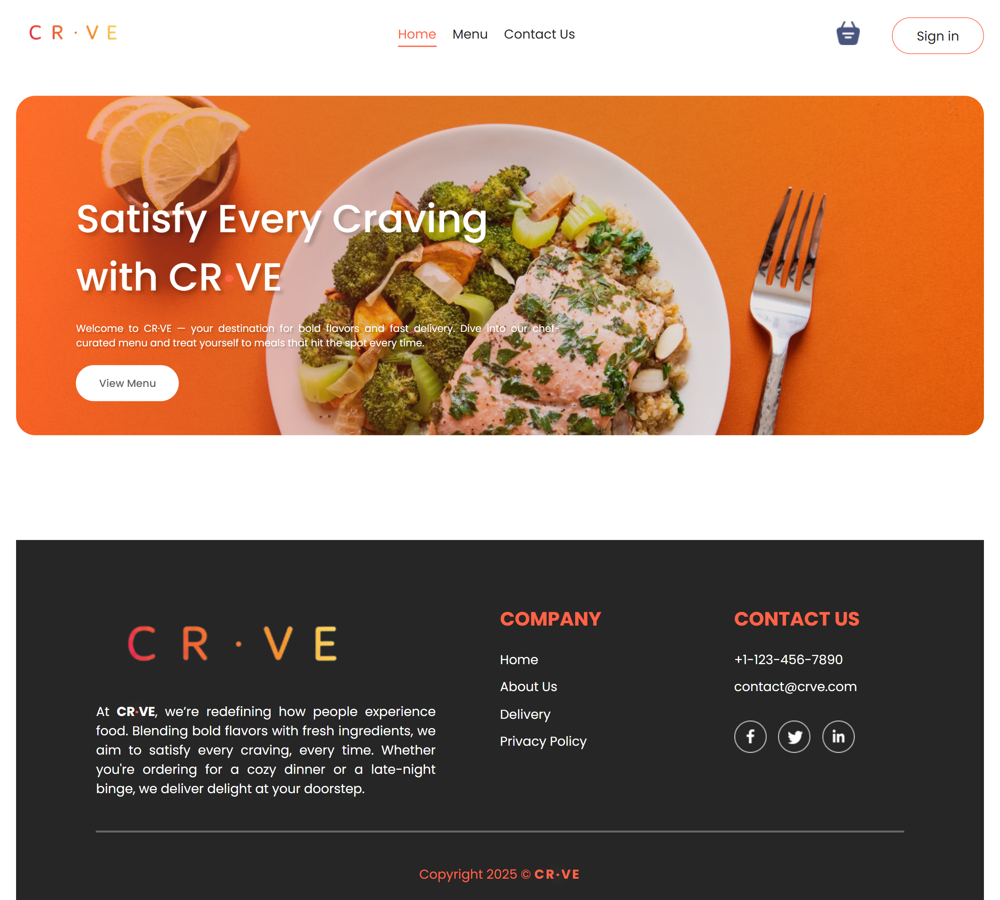
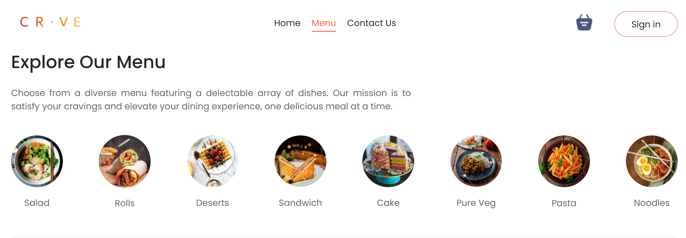
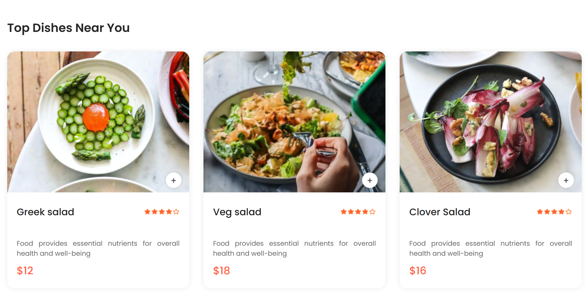
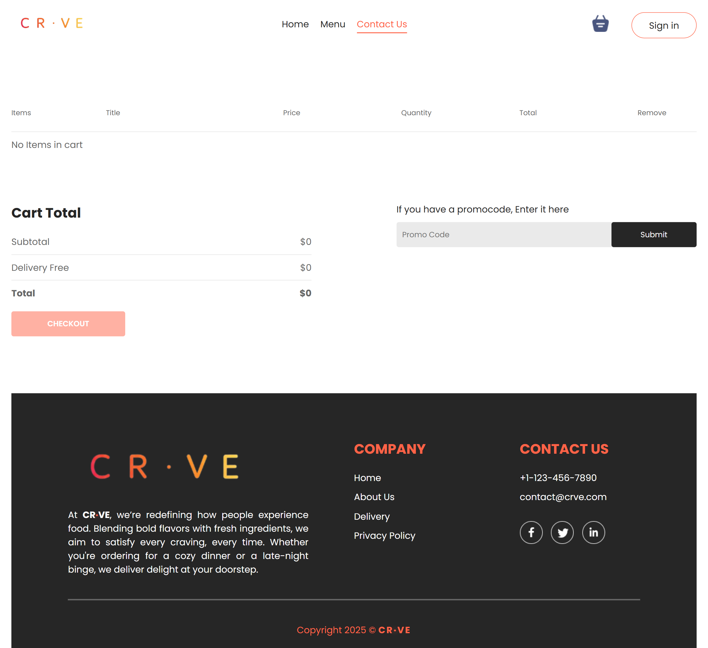
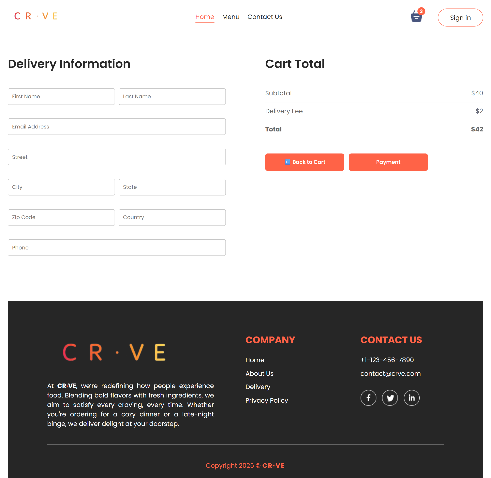
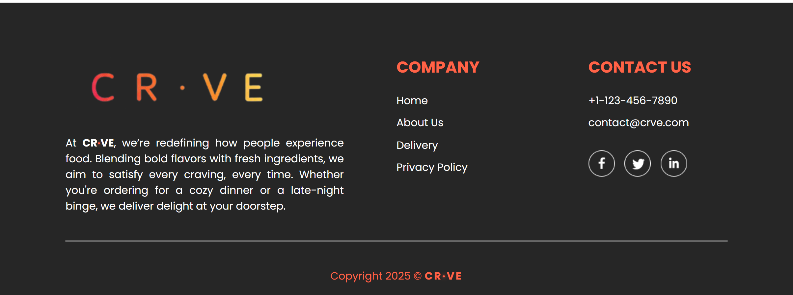
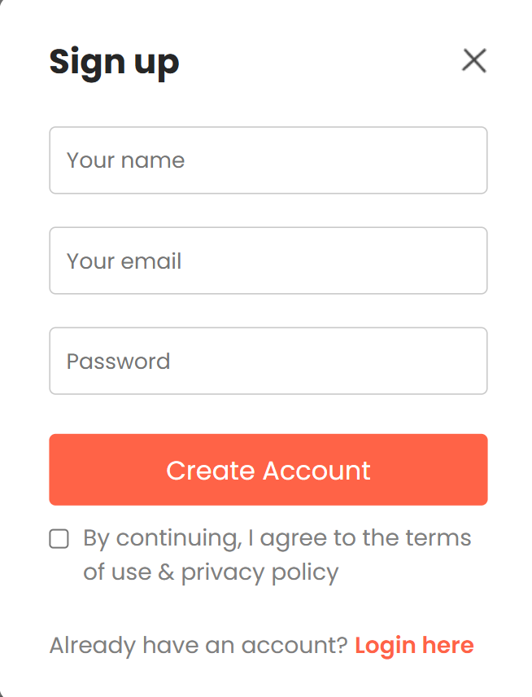

# 🍽️ CR.VE - IBM

A modern, responsive frontend food ordering website built using **React.js** and **Vite**. 
This project simulates a real-world food delivery platform with features like menu Browse, cart management, and a polished UI.

---

## 🚀 Features

- 🧭 Explore categorized menus  
- 🛒 Add/remove items to/from cart  
- 📱 Mobile-first responsive design  
- ⚛️ Built with React.js + Vite  
- 🎨 Styled with modern CSS  

---

## 🛠️ Tech Stack

- **Frontend:** React.js, Vite, CSS, HTML  
- **Languages:** JavaScript (ES6+)  
- **Version Control:** Git + GitHub  

---

## 📂 Project Structure

CR.VE-IBM
├── public
├── screenshots
└── src
    ├── assets
    ├── components
    │   ├── ExploreMenu
    │   ├── FoodDisplay
    │   ├── FoodItem
    │   ├── Footer
    │   ├── Header
    │   ├── LoginPopup
    │   └── Navbar
    ├── context
    └── pages
        ├── Cart
        ├── Home
        ├── Menu
        └── PlaceOrder

---

## 🖼️ Screenshots

Here are some key views of the application:

<br/>

### Homepage
[](screenshots/home_page.png)

### Menu
[](screenshots/menu.png)

### Food Items
[](screenshots/food_items.png)

### Cart
[](screenshots/cart.png)

### Checkout
[](screenshots/checkout.png)

### About Us
[](screenshots/about_us.png)

### Sign Up
[](screenshots/sign_up.png)

---

## 📦 Setup Instructions

To run this project locally, follow these steps:

1.  **Clone the repository:**
    ```bash
    git clone [https://github.com/yourusername/your-repo-name.git](https://github.com/yourusername/your-repo-name.git)
    cd your-repo-name
    ```

2.  **Install dependencies:**
    ```bash
    npm install
    ```

3.  **Start the development server:**
    ```bash
    npm run dev
    ```

The application will be accessible at `http://localhost:5173`.

---

## 🎯 Roadmap

* [ ] **User Authentication:** Implement user sign-in and sign-up with a backend.
* [ ] **Payment Integration:** Add a secure payment gateway for checkout.
* [ ] **Order History:** Allow users to view their past orders.
* [ ] **Admin Panel:** Create an interface for managing menu items.

---

## 🤝 Contributing

Contributions are what make the open-source community an amazing place to learn, inspire, and create. Any contributions you make are **greatly appreciated**.

If you have a suggestion that would make this better, please fork the repo and create a pull request. You can also simply open an issue with the tag "enhancement".

1.  Fork the Project
2.  Create your Feature Branch (`git checkout -b feature/AmazingFeature`)
3.  Commit your Changes (`git commit -m 'Add some AmazingFeature'`)
4.  Push to the Branch (`git push origin feature/AmazingFeature`)
5.  Open a Pull Request

---

## 📄 License

Distributed under the MIT License. See `LICENSE.txt` for more information.

---

## 👨‍💻 Developed By

Yuvraj Singh

---